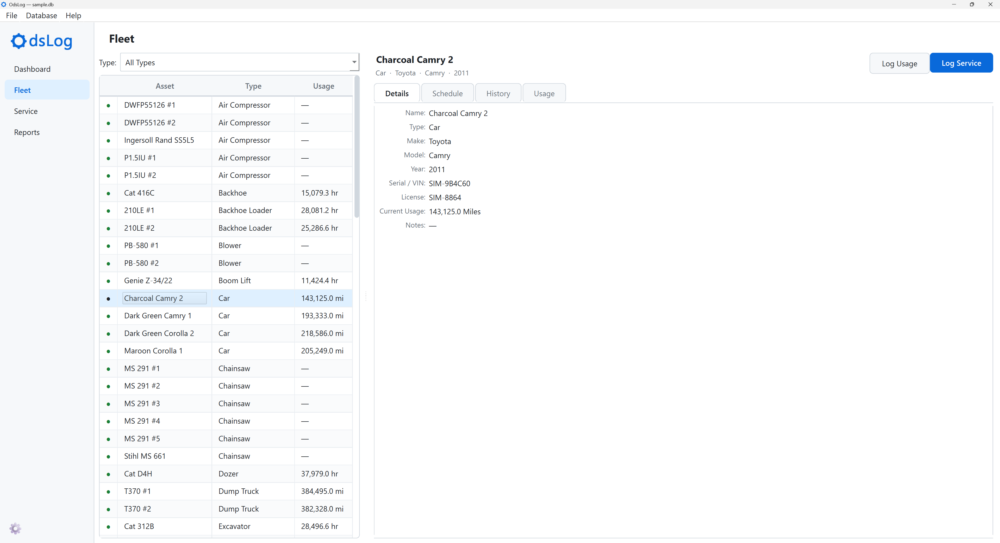
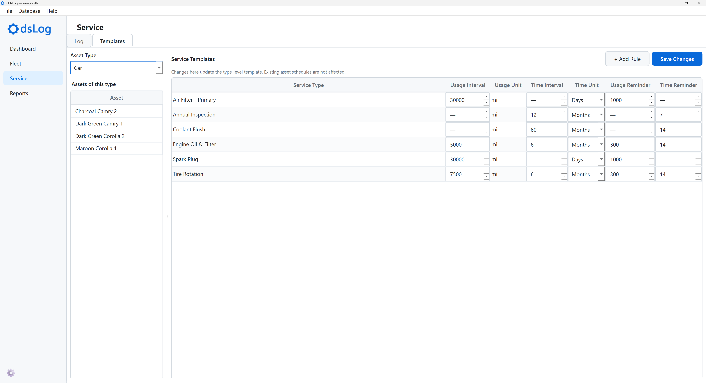
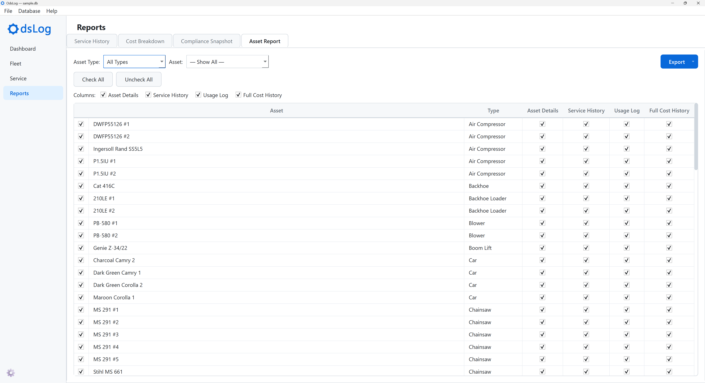
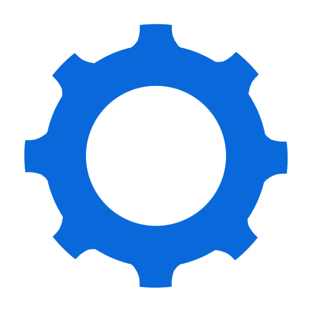

## Project Details

  - Project Type: Personal Software Project
  - Role: Solo Developer
  - Key Achievements:
    - Developed an end-to-end Python desktop application (PySide6, SQLite) for tracking fleet service and cost across vehicles, equipment, and tools
    - Identified a structural flaw in an over-normalized schema AI couldn't catch and redesigned it into the application's core template system
    - Built custom debug tooling to diagnose a Qt clipping defect after standard fixes failed, tracing it to a framework-level default setting
    - Integrated an in-app sample database generator to evaluate [dashboards](https://odslog-manual.netlify.app/dashboard#summary-tab) at real fleet scale, surfacing what tasks need attention first
    - Authored a user manual enabling full self-service onboarding for a solo-built application with no support team

## Background

OdsLog was built from my personal experience as a mechanic, understanding the needs of the field firsthand. Part of my role involved digitizing records into a dedicated proprietary database application, pulling data from both paper logs in glove boxes and electronic spreadsheets. The application produced polished reports that management liked, but was ultimately abandoned a few years later. It cost money to maintain, individual Excel files were often faster for day-to-day use, and the periodic reviews it was built to support happened rarely enough that a manual report became the simpler choice. OdsLog is my attempt to apply that real-world understanding, this time with a tool built to last: no cost, no proprietary format.

For a mechanic maintaining a small-scale fleet (80+ vehicles and machinery), speed and data portability are key. OdsLog comes prepackaged with a [sample data generator](https://odslog-manual.netlify.app/home-screen#optional-skip-straight-to-real-data) to show you what that scenario looks like, and the manual includes a full [walkthrough](https://odslog-manual.netlify.app/walkthrough) if you would like to see the application in action.

Thanks for taking a look!

::: {.panel-tabset}
## Dashboard

## Fleet

## Service

## Reports

:::

## Links

{width=32px} [Get OdsLog](https://github.com/oliverdsiu/ods-log/releases/latest)

{width=32px} [User Manual](https://odslog-manual.netlify.app/)

{width=32px} [GitHub Repository](https://github.com/oliverdsiu/ods-log)
